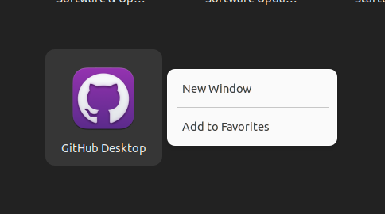

# Installation Guide: GitHub Desktop on Linux

This guide will walk you through the process of installing GitHub Desktop on Linux.

## Prerequisites

- Ubuntu-based Linux distribution
- Terminal access

## Installation Steps

1. Open a terminal using 

    `Ctrl + Alt + T`.

2. Download the GitHub Desktop .deb package:

```shell
sudo wget https://github.com/shiftkey/desktop/releases/download/release-2.8.1-linux2/GitHubDesktop-linux-2.8.1-linux2.deb


3. Once the download is complete, navigate to the download directory:

```shell
cd ~/Downloads


4. Install GitHub Desktop using dpkg:

```shell
sudo dpkg -i GitHubDesktop-linux-2.8.1-linux2.deb

5. Launch GitHub Desktop from the application menu.

    Verification

To confirm that GitHub Desktop is installed, open the application menu and search for GitHub Desktop. 

You should see the icon and be able to launch it.


Congratulations, you have successfully installed GitHub Desktop on your Linux system!

6. Adding GitHub Desktoop to favorites

Right-click on the GitHub Desktop icon and select "Add to Favorites" to easily access it.




7. Now you are ready to go! Enjoy using GitHub Desktop for your repositories.


Happy Coding!
